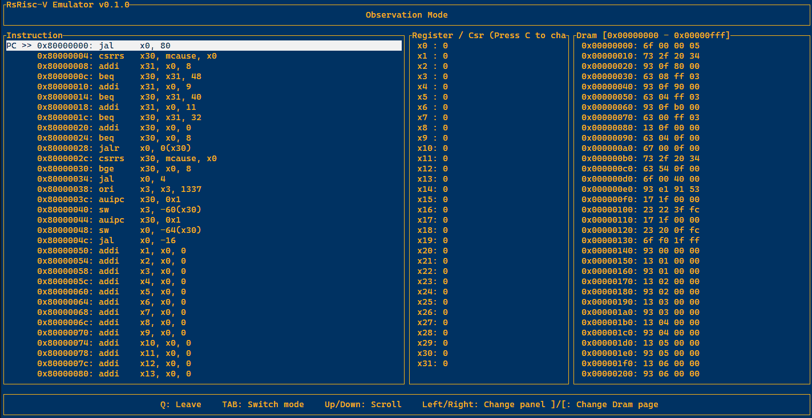

  
# RsRisc-V Emu: Interactive RV32IM Emulator in Rust

(Not update for now) [RsRisc-V Asm here](https://github.com/Eender753030/RsRiscV_asm)

## Key Features
- **ISA Support**:
    - **RV32IM Core**: Implements Base Integer (I) and Multiply/Divide (M) extensions.
    - **Standard Extensions**: Supports **Zicsr** (Control and Status Register) and **Zifencei**.
    - **Privileged Mode**: Implements **Machine Mode (M-Mode)** with precise Exception & Interrupt handling.
    - **Compliance**: Passes official **[riscv-tests](https://github.com/riscv-software-src/riscv-tests)** (success in `rv32ui` and `rv32um` suites).
    
- **System & Peripherals**:
    - **Memory**: **2GB** Virtualized/Demand-Paged DRAM (base address `0x8000_0000`).
    - **UART**: Memory-mapped serial output at `0x1000_0000` (mapped to host stdout).

- **Smart Loader**:
    - **ELF Support**: Automatically parses ELF headers, loads segments (text/data), and initializes BSS.
    - **Raw Binary**: Fallback support for flat binary files.

- **Interactive TUI**:
    - **Live Disassembly**: Real-time instruction decoding and pipeline visualization.
    - **Dual Register View**: Toggle between **General Purpose Registers (x0-x31)** and **CSRs** (mstatus, mepc, etc.).
    - **Deep Memory Inspection**: Browse the entire 2GB memory space with paging controls.

## Demo


## Quick Start
### Prerequisites
- Rust toolchain (stable) installed.

### Installation

```bash
# Clone the repository
git clone https://github.com/Eender753030/RsRiscV_emu.git
cd RsRiscV_emu

# Build the project in release mode for best performance
cargo build --release
```
### Usage
Run the emulator by passing a binary file (machine code) as an argument:

```Bash

# Syntax
cargo run --release <path_to_binary_file>

# Example
cargo run --release ./test
```
**Note**: The input file can be a standard **ELF** file or a raw binary (Little Endian).

## 🎮 Controls & Key Bindings

The UI is designed to be keyboard-centric for efficiency.

| Context | Key | Action | Description |
| :--- | :--- | :--- | :--- |
| **General** | `Tab` | **Switch Mode** | Toggle between **Observation** (Browse) and **Emulate** (Debug) modes. |
|             | `Q` | **Quit** | Exit the application immediately. |
| **Navigation**<br>*(Observation)* | `←` / `→` | **Change Panel** | Move focus between Instruction, Register/CSR, and Memory panels. |
| | `↑` / `↓` | **Scroll** | Scroll through the lists in the currently active panel. |
| | `C` | **Toggle View** | Switch between **GPR (x0-x31)** and **CSR** view in the Register panel. |
| | `[` / `]` | **Page Mem** | Navigate to Previous/Next Memory Page (4KB). |
| **Debug**<br>*(Emulate)* | `S` | **Step** | Execute the next instruction (Single-step). |
| | `P` | **Run to End** | Continuously execute instructions until program exit or error. |
| | `R` | **Reset** | Reset PC to initial state and clear registers/memory. |

## License

This project is licensed under the MIT License - see the [LICENSE](LICENSE) file for details.
